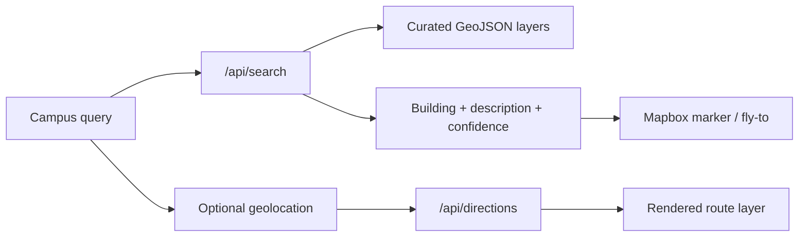

# RPInSight

<p align="center">
  <strong>AI-assisted campus navigation with Mapbox, GeoJSON, and curated RPI location data.</strong>
</p>

<p align="center">
  
  
  
  
  
  
</p>

RPInSight is a campus navigation prototype for Rensselaer Polytechnic Institute. It combines a Mapbox campus map, curated GeoJSON location layers, directions, and a campus-grounded search assistant for finding dining, study, lecture, and parking locations.

**Quick nav:** [Demo Scope](#demo-scope) · [Features](#core-features) · [Data](#campus-data) · [Architecture](#architecture) · [Security](#security-and-privacy) · [Quick Start](#quick-start) · [Validation](#validation)

## Demo Scope

RPInSight is supporting evidence for my QGIS/geospatial portfolio. It is not the main QGIS proof; the flagship asset package lives here:

<https://github.com/Taz33m/qgis-ai-geospatial-assets>

This repo shows the adjacent product layer: turning curated location data into a usable map interface with route UX, search, and location-aware responses.

## Core Features

- **Mapbox campus map:** interactive RPI campus navigation with custom style support.
- **Curated GeoJSON layers:** dining, study, lecture, and parking points stored under `src/data/`.
- **Campus search assistant:** `/api/search` grounds answers in the local campus dataset and returns a building name, description, coordinates, and confidence cue.
- **Directions API route:** `/api/directions` proxies Mapbox Directions requests without logging token-bearing URLs.
- **Route rendering:** walking, cycling, and driving paths are drawn back onto the map.
- **Data QA panel:** the UI links this product back to the public QGIS QA portfolio.

## Product Flow



## Campus Data

| Layer | File | Count | Purpose |
|---|---:|---:|---|
| Dining halls | `src/data/dining_halls.geojson` | 4 | Meal-plan dining and food locations. |
| Study halls | `src/data/study_halls.geojson` | 4 | Library and student study spaces. |
| Lecture halls | `src/data/lecture_halls.geojson` | 9 | Major classroom and academic buildings. |
| Parking | `src/data/parking.geojson` | 5 | Visitor and permit parking points. |

The campus dataset is intentionally compact and reviewable. Search confidence is explicit: exact matches use curated coordinates, while uncertain results are marked approximate or withheld.

## Architecture

RPInSight is a Next.js application with three small layers:

- **UI layer:** `src/components/MapComponent.jsx`, `SearchBar.tsx`, and supporting UI components.
- **Data layer:** bundled GeoJSON feature collections in `src/data/`.
- **API layer:** server routes for campus search and Mapbox directions under `src/app/api/`.

```text
src/app/
  api/directions/route.ts
  api/search/route.ts
src/components/
  MapComponent.jsx
  SearchBar.tsx
  DataMethodologyPanel.tsx
src/data/
  dining_halls.geojson
  lecture_halls.geojson
  parking.geojson
  study_halls.geojson
```

## Security and Privacy

This repo has been cleaned up for public presentation:

- No committed API keys or secret `.env` files.
- Public Mapbox configuration is read from `NEXT_PUBLIC_*` variables; server routes can use server-only `MAPBOX_TOKEN`.
- API routes validate request bodies before calling external services.
- Search and directions routes include lightweight request throttling.
- Directions are bounded to the RPI campus area to reduce accidental token abuse.
- Directions requests do not log full Mapbox URLs or access tokens.
- Popup HTML escapes GeoJSON properties before rendering.
- Security headers disable framing, MIME sniffing, and unnecessary browser permissions.

See [SECURITY.md](SECURITY.md) for the public security posture and reporting note.

## Quick Start

```bash
cp .env.example .env.local
npm install
npm run dev
```

Open <http://localhost:3000>.

Required environment variables:

- `NEXT_PUBLIC_MAPBOX_TOKEN`: public Mapbox token for browser map rendering.
- `NEXT_PUBLIC_MAPBOX_STYLE_URL`: Mapbox style URL.
- `NEXT_PUBLIC_CAMPUS_CENTER_LNG` / `NEXT_PUBLIC_CAMPUS_CENTER_LAT`: default map center.
- `MAPBOX_TOKEN`: optional server-side Mapbox token for directions.
- `OPENAI_API_KEY`: optional server-side key for AI-backed campus search. Without it, exact local dataset matches still work.

## Validation

```bash
npm run type-check
npm run lint
npm run build
npm audit --audit-level=moderate
```

## Limitations

- RPInSight is not an official RPI service.
- The dataset is curated for a product demo, not exhaustive campus operations.
- Directions depend on Mapbox coverage and the provided style/token configuration.
- AI search should be treated as campus assistance, not authoritative emergency or accessibility guidance.

## Portfolio Context

Recommended submission hierarchy:

1. Main portfolio page: <https://tazeemm.com/qgis-portfolio>
2. Flagship QGIS asset package: <https://github.com/Taz33m/qgis-ai-geospatial-assets>
3. Companion evaluator toolkit: <https://github.com/Taz33m/gis-ai-evaluation-lab>
4. Supporting geospatial product: this repo.
